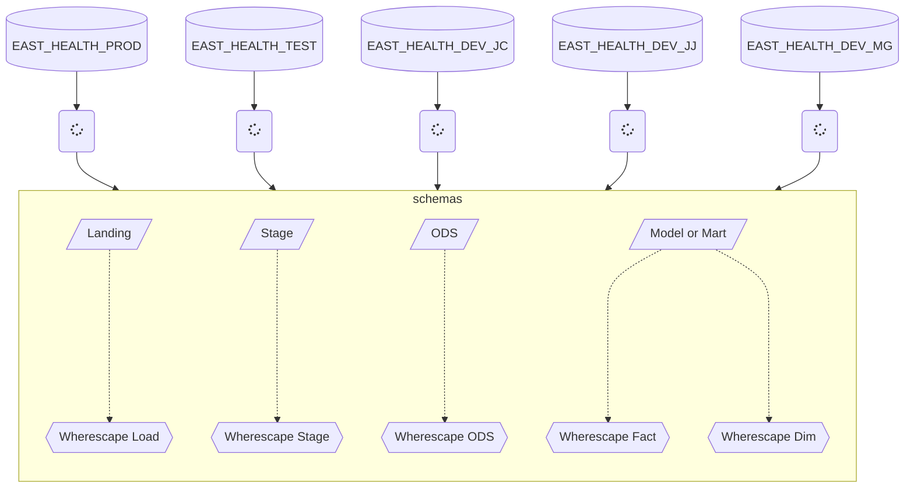

```mermaid
flowchart TB
db_prod[(EAST_HEALTH_PROD)]
db_test[(EAST_HEALTH_TEST)]
db_dev_jc[(EAST_HEALTH_DEV_JC)]
db_dev_jj[(EAST_HEALTH_DEV_JJ)]
db_dev_mg[(EAST_HEALTH_DEV_MG)]

node_prod(fa:fa-spinner)
node_test(fa:fa-spinner)
node_dev_jc(fa:fa-spinner)
node_dev_jj(fa:fa-spinner)
node_dev_mg(fa:fa-spinner)

db_prod-->node_prod
db_test-->node_test
db_dev_jc-->node_dev_jc
db_dev_jj-->node_dev_jj
db_dev_mg-->node_dev_mg

subgraph schemas
    direction TB
    
    model[/Model or Mart/]
    stage[/Stage/]
    ws_fact{{Wherescape Fact}}
    ws_dim{{Wherescape Dim}}

    raw[/Landing/]
    ods[/ODS/]
    
    ws_ods{{Wherescape ODS}}
    ws_load{{Wherescape Load}}

    raw -...-> ws_load

    ws_stage{{Wherescape Stage}}
    stage -...-> ws_stage
    ods -...-> ws_ods

    model -...-> ws_fact
    model -...-> ws_dim
end

node_prod --> schemas
node_test --> schemas
node_dev_jc --> schemas
node_dev_jj --> schemas
node_dev_mg --> schemas
```

